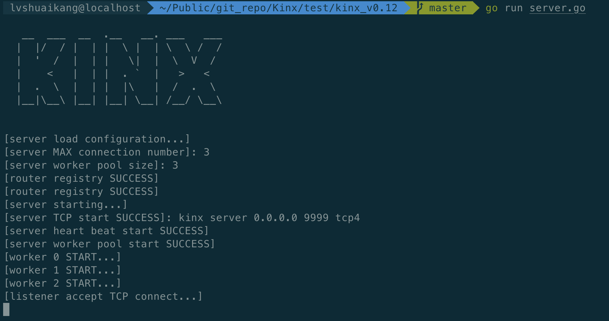

# Kinx

Kinx是TCP服务框架，是使用【IO多路复用+多线程】实现的单点server。Kinx可处理并发连接，可通过配置【线程池大小】或【连接数量】减少cpu负载，同时【连接管理模块】和【心跳检测】能有效节省服务器资源。

# 使用

### 框架使用：

test包下有详细的使用示例，这里只做简单描述：
```go
package main

import (
	"fmt"
	"github.com/k-si/Kinx/kiface"
	"github.com/k-si/Kinx/knet"
)

type PingRouter struct {
	knet.BaseRouter
}

// 处理读业务，需要继承BaseRouter并实现Handle方法，在该方法编写具体业务逻辑。
func (p *PingRouter) Handle(req kiface.IRequest) {
	fmt.Println(">>>>>>> handler ping router")

	if err := req.GetConnection().SendMessage(0, []byte("ping client...")); err != nil {
		fmt.Println("server send message to client err:", err)
	}
}

// 其他钩子函数
func (p *PingRouter) PreHandle(req kiface.IRequest) {
	fmt.Println("pre")
}

func (p *PingRouter) PostHandle(req kiface.IRequest) {
	fmt.Println("post")
}

func main() {
	c := knet.DefaultConfig()
	s := knet.NewServer(c)

	// 业务函数注册
	pr := &PingRouter{}
	s.AddRouter(0, pr)
	
	// 启动服务
	s.Serve()
	defer s.Stop()
}
```

### 服户启动：


# 版本变更

[点此查看](https://github.com/k-si/Kinx/blob/master/version_change.md)


